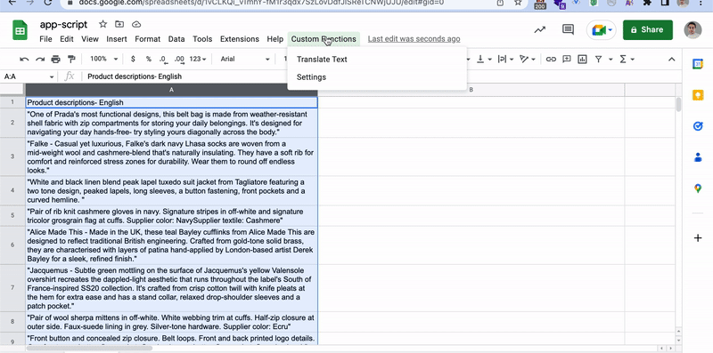

# ChatGPT-Google Sheet Script

Transformative script for your workplace

ChatGPT-Google Sheet is a Google Sheets add-on that allows users to easily manipulate text in their spreadsheets using the OpenAI API. With a simple menu, users can translate, classify, transform, revise, ...  text within a selected range and automatically insert the transformed content into adjacent cells.

## Installation

1. To install this project, first make a copy of the Google Sheet template from [https://sheets.new](https://sheets.new)
2. In the copied Google Sheet, click on `Extensions` > `Apps Script` to open the Google Apps Script editor.
3. Replace the existing code with the code provided above and save the script by clicking on the floppy disk icon.
4. Close the Apps Script editor and return to your Google Sheet.

## Usage

1. In your Google Sheet, click on `Extensions` > `Custom Functions` > `Settings` to open the Settings dialog.
2. Enter your OpenAI API key and a prompt to guide the translation. For example, "Translate the following English text to French: ".
3. Select the range of cells containing the text you want to translate.
4. Click on `Extensions` > `Custom Functions` > `Translate Text` to begin the translation process.
5. The translated text will be inserted into the adjacent cells.

## Contributions

If you would like to contribute to the this project, please follow these steps:

1. Fork the repository on GitHub.
2. Create a new branch for your feature or bug fix.
3. Make your changes and submit a pull request.
4. Wait for a maintainer to review your changes and provide feedback.
